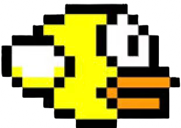

# FlappyBird 

This project is an experimental game where I explore various game mechanics, especially collision detection and game logic. The goal is to experiment and understand how different elements interact within a simple game environment.

Built using p5.js and p5play, this game serves as a platform for testing custom implementations of collision logic, object movement, and obstacle generation.
